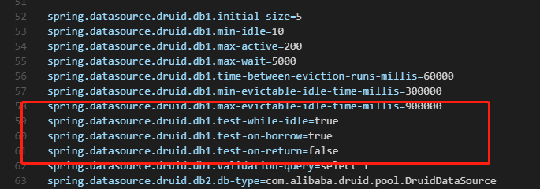
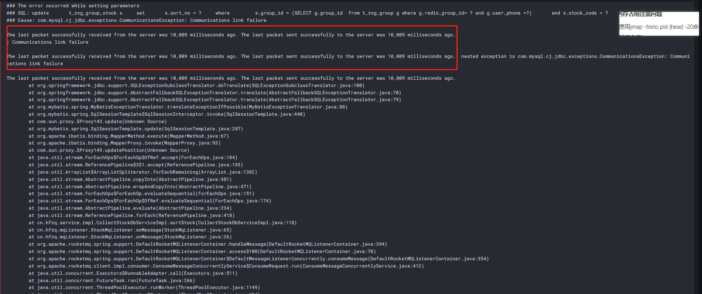
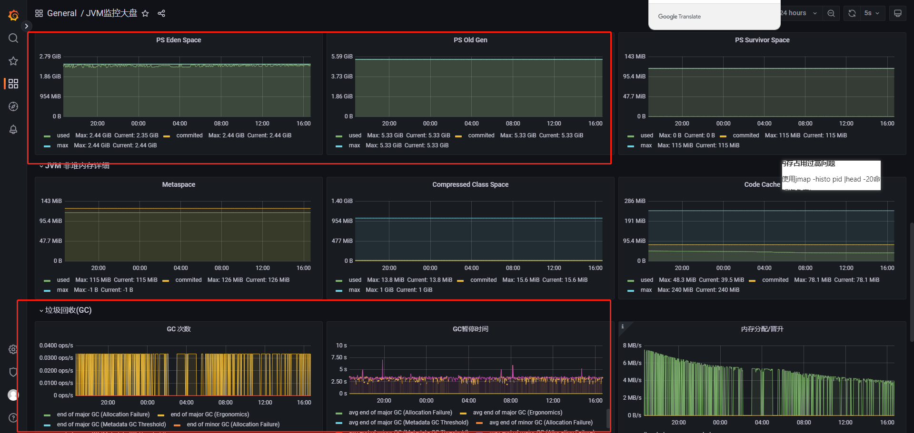
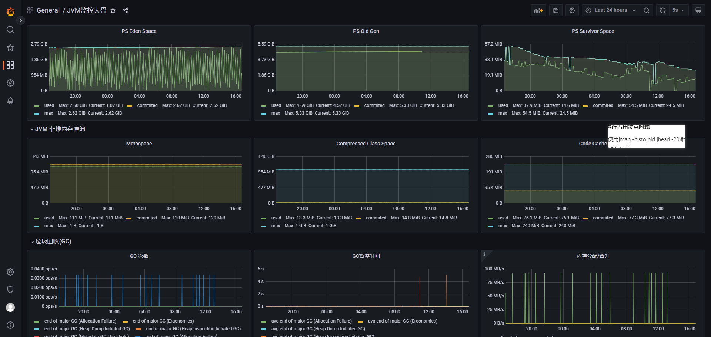

### 时间

2021/02/3

### 项目

rdc 生产collectServer 自选股服务

### 背景

* 自选股 生产数据库为MariaDb 集群，服务为三实例
* 测试环境为mysql单机，服务单机
* 生产mq消息堆积20w 原因未知

### 现象

自选服务大量报错，jvm监控GC频繁，堆内存（老年代）一直很高,且其中一台服务进程仍存在，但实际已于nacos下线，线程全部阻塞，无法响应任何外部请求

并有大量报错（`The last packet successfully received from the server was 10,009 milliseconds ago. The last packet sent successfully to the server was 10,009 milliseconds ago`）

此报错搜索得到结果大多是druid mysql连接配置问题（），程序中未释放掉失效连接，执行sql时爆出，但反复检查druid配置，没有发现配置错误









### 排查经过

#### 一、索引问题

* 把错误sql拿出来expain，发现未走索引（ALL 全表扫描），实际该列有索引，delete改select也能走索引，且测试环境能正常走索引

```
explain
delete
from t_zxg_group_stock
where group_id in (select group_id
                   from t_zxg_group
                   where user_phone = '18888888888')
  and stock_code in
      (
          '600675|83'
          );
```

* 修改sql in查询为join    [http://www.taodudu.cc/news/show-1177613.html?action=onClick](http://www.taodudu.cc/news/show-1177613.html?action=onClick)
* 使用explain show warnings,查看mysql最终执行器优化后的实际sql。
* mysql 官网建议 update delete 时使用join 而非in 修改sql ，再次explain  成功命中索引

```
explain
delete a
from t_zxg_group_stock a
         inner join
     t_zxg_group b
     on a.group_id = b.group_id
where a.stock_code in
      (
          '900908|83'
          )
  and b.user_phone = '18888888888';
```

#### 二、内存问题

* jps -l  获取问题服务的pid  （或ps -ef  | grep java）
* dump非常耗时，可以先查看jvm中最大的前20个存活对象，jmap -histo:live  pid | head -n 20
* 上述只能看出来某个类所占内存很大，如果是底层的B（byte），C（char）等等将无法排查，需要dump具体信息
* jmap -dump:format=b,live,file=dump.hprof
* 使用memory analyzer分析dump文件  右键list object 查看所有实例


#### 三、服务下线问题

* jstack 输出 几乎全是IO相关  BLOCK/WAIT
* 同时查看db死锁日志 全是问题1 未命中索引引起的update/delete 行级锁 锁到了全表900w数据，导致死锁

### 总结

* 索引需要精简高效，对高频字段建联合索引，写好的复杂sql 最好先自测阶段explain
* 环境不一致导致的问题，很难避免，数据量不一致/环境信息不一致 等等都可能

[deadlock](../experience/assets/deadlock.txt)

### 代码片段


