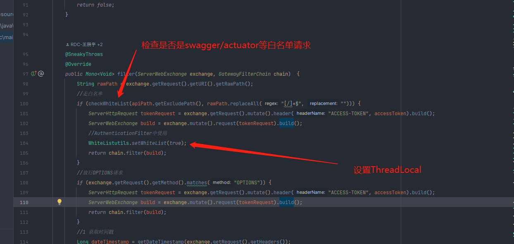
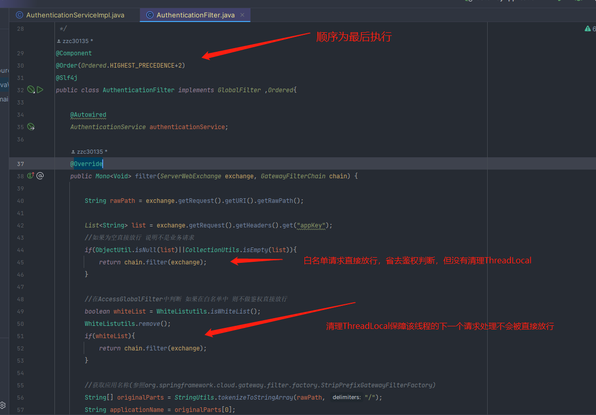
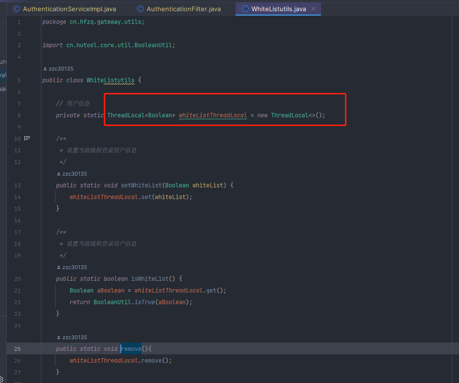

### 时间

2021/01/24

### 项目

rdc 准生产gateway

### 现象

gateway 设置鉴权,因为没有配置对应服务相关信息，预期为全部拦截,实际拦截结果为偶现放行（postman手动调接口验证），且放行比例不确定，总体是越来越低（后面总结才发现）

### 排查经过

1. 偶现问题，首先思考负载均衡，是否有多实例。上nacos确认，准生产gateway仅一个实例
2. 鉴权报错报在mysql查询数据库，不存在对应服务的鉴权配置信息。因生产mysql是mariadb集群（6个节点）怀疑是节点数据不一致问题
3. 确认配置情况，遇到nacos中既有shareConfig又有 gateway.properties又有gateway.yaml。确认配置无疑，mysql准生产为单机，排除负载均衡相关问题
4. 准生产年久失修，怀疑代码版本，经过ll命令查看jar包更新时间，未能确实是否是最新代码，遂拉下jar包，解压还原，使用beyond compare文件夹对比工具 逐个文件比较，最后排除
5. 因代码中有自定义 springcache注解处理类，再次怀疑是redis集群（3主3从）相关负载均衡问题，怀疑是某节点主备都挂了。但很快排除
6. 本地启动gateway，并修改配置保持与准生产一致，准备复现
7. 几十次请求始终没有复现，代码与配置都一致，迟迟无法确定问题
8. 删除cache注解，重新发布，保证每次都查库，仍然有请求被放行（预期外）使用控制变量法，排除cache注解问题
9. 增加log日志，tail -f 因为是好几次请求才能复现一次，tail -f一直刷，非常难看。未能定位问题。
10. 通过一次次点击postman 并且记录放行请求数与拦截请求数，再cat grep日志数，最终发现放行的请求没有走到对应逻辑
11. 准备定位为什么没有走到对应代码，是否是开源org.springframework.cloud.gateway.filter问题，无思路
12. 请求代码作者铮超技术支持
13. 安装 arthas  通过watch命令 定位方法出参
14. 实锤同样请求 返回不同结果
15. 分析代码找到 原因 ：使用threadLocal 存储了线程白名单（目的是为了filter链路下的后续节点能快速通过），但没有正确的清空threadLocal数据，导致下一个请求过来，误用了白名单被放行

### 总结

* 代码没有仔细看，看到变量名为为wihteList就想当然的以为是取的nacos配置里的白名单List（白名单有swagger  autuator等请求）
* 本地代码一致数据一致 但没有复现，原因是准生产的gateway会收到各种options/swagger请求，这些请求走白名单，而本地没有，故无法复现
* 放行比例不确定。rdc环境没有配置负载均衡相关策略，一般默认都是轮询，若放行异常无规律，基本可以排除负载均衡问题
* 放行比例总体是越来越低，因为从最开始，没有我的异常请求，所有线程几乎都走白名单，未能异常清空，但是随着异常请求越来越多，反而走不到异常场景

### 代码片段

