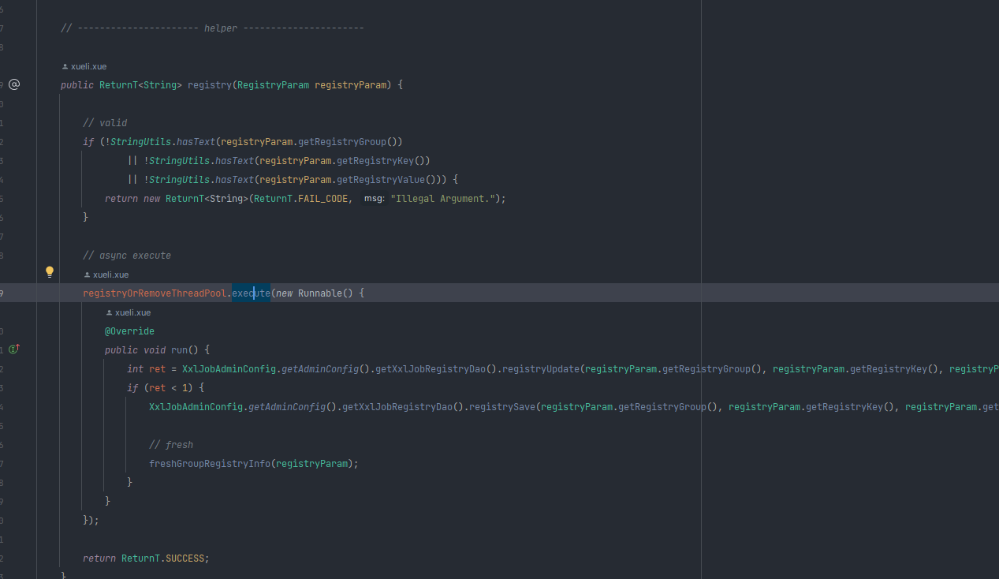
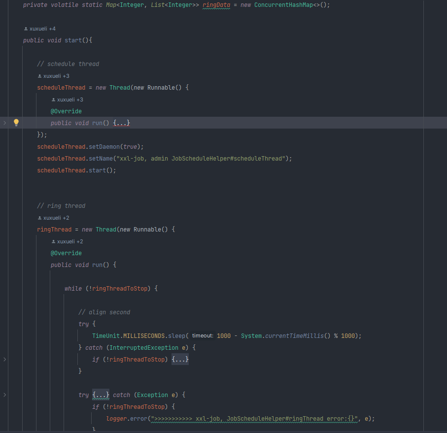
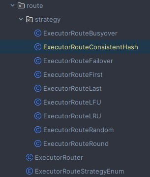

### 调度中心与执行器的健康检查

调度中心即xxl-job的Java进程（服务端），执行器即引用任务所在Java进程（客户端）
执行器进程每30秒在MySQL中更新updateTime字段，若90秒仍未更新，则被认为是dead状态


### 集群调度

调度中心集群部署时，通过 手动开启事务 select for update，对代码进行加锁（表级锁），保障同一时间仅有一个调度中心会向执行器发出调度指令。

等待任务进行完后，才进行刷新任务下次执行时间等操作（任务下次触发时间是存储在mysql中）。

```mysql
select * from xxl_job_lock where lock_name = 'schedule_lock' for update
```


### 快慢触发器

默认任务触发器为fastTriggerPool，执行偏慢的任务将由slowTriggerPool处理，避免资源占用导致堵塞。
两个触发器除了linkedBlockingQueue长度不一样外其他都是一样。
1分钟超过10次超时的job将认定为慢任务。

```java
public class JobTriggerPoolHelper {
    public void start() {
        fastTriggerPool = new ThreadPoolExecutor(
                10,
                XxlJobAdminConfig.getAdminConfig().getTriggerPoolFastMax(),
                60L,
                TimeUnit.SECONDS,
                new LinkedBlockingQueue<Runnable>(1000),
                new ThreadFactory() {
                    @Override
                    public Thread newThread(Runnable r) {
                        return new Thread(r, "xxl-job, admin JobTriggerPoolHelper-fastTriggerPool-" + r.hashCode());
                    }
                });

        slowTriggerPool = new ThreadPoolExecutor(
                10,
                XxlJobAdminConfig.getAdminConfig().getTriggerPoolSlowMax(),
                60L,
                TimeUnit.SECONDS,
                new LinkedBlockingQueue<Runnable>(2000),
                new ThreadFactory() {
                    @Override
                    public Thread newThread(Runnable r) {
                        return new Thread(r, "xxl-job, admin JobTriggerPoolHelper-slowTriggerPool-" + r.hashCode());
                    }
                });
    }
}
```

### 守护线程与调度触发

scheduleThread.setDaemon(true);//设置为守护线程，固定在后台执行
scheduleThread每五秒计算各个job的5秒内的下次触发时间，维护进内存 ConcurrentHashMap 中，key为秒数，value为jobId
ringThread 每秒中读取ConcurrentHashMap的数据，进行任务触发




### 分布式调度策略


通过策略模式，提供多种调度策略（第一个，随机，分片广播，一致性hash）

其中一致性hash策略  通过增大hash环数量，让多个job之间分配更加均匀

```java


/**
 * 分组下机器地址相同，不同JOB均匀散列在不同机器上，保证分组下机器分配JOB平均；且每个JOB固定调度其中一台机器；
 *      a、virtual node：解决不均衡问题
 *      b、hash method replace hashCode：String的hashCode可能重复，需要进一步扩大hashCode的取值范围
 * Created by xuxueli on 17/3/10.
 */
public class ExecutorRouteConsistentHash extends ExecutorRouter {

    private static int VIRTUAL_NODE_NUM = 100;

   

    public static String hashJob(int jobId, List<String> addressList) {

        // ------A1------A2-------A3------
        // -----------J1------------------
        TreeMap<Long, String> addressRing = new TreeMap<Long, String>();
        for (String address: addressList) {
            for (int i = 0; i < VIRTUAL_NODE_NUM; i++) {
                long addressHash = hash("SHARD-" + address + "-NODE-" + i);
                addressRing.put(addressHash, address);
            }
        }

        long jobHash = hash(String.valueOf(jobId));
        SortedMap<Long, String> lastRing = addressRing.tailMap(jobHash);
        if (!lastRing.isEmpty()) {
            return lastRing.get(lastRing.firstKey());
        }
        return addressRing.firstEntry().getValue();
    }

    @Override
    public ReturnT<String> route(TriggerParam triggerParam, List<String> addressList) {
        String address = hashJob(triggerParam.getJobId(), addressList);
        return new ReturnT<String>(address);
    }

}
```

##### 任务告警
预留jobAlarm接口，提供给开发者自行定义告警（钉钉/企微等等）

```java
public interface JobAlarm {
    public boolean doAlarm(XxlJobInfo info, XxlJobLog jobLog);
}
```